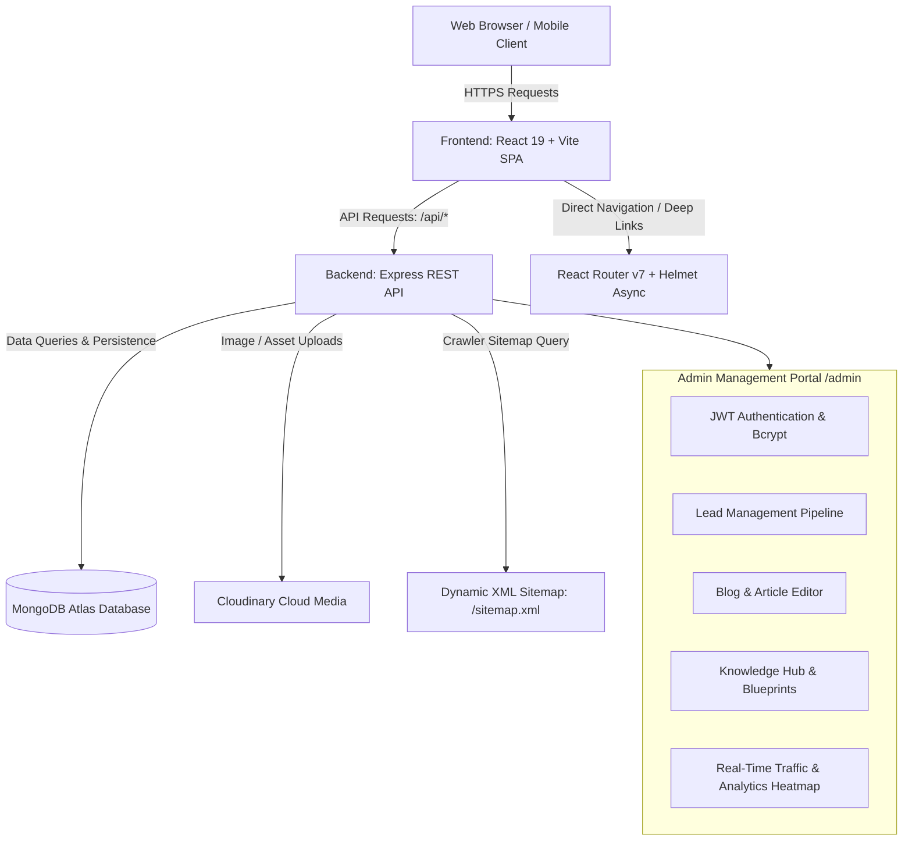
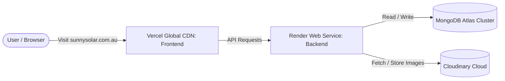

# ☀️ Sunny Solar — Full-Stack Monorepo Documentation

[](https://react.dev/)
[](https://www.typescriptlang.org/)
[](https://vitejs.dev/)
[](https://tailwindcss.com/)
[-339933?logo=node.js&logoColor=white)](https://nodejs.org/)
[](https://expressjs.com/)
[](https://www.mongodb.com/)
[](https://cloudinary.com/)
[](#license)

---

## 📖 Table of Contents

1. [Executive Overview](#-executive-overview)
2. [Architecture & System Flow](#-architecture--system-flow)
3. [Repository Directory Structure](#-repository-directory-structure)
4. [Customer-Facing Website Features](#-customer-facing-website-features)
5. [Interactive Calculators Suite](#-interactive-calculators-suite)
6. [Admin Management Portal](#-admin-management-portal)
7. [Technology Stack](#-technology-stack)
8. [Prerequisites & System Requirements](#-prerequisites--system-requirements)
9. [Step-by-Step Installation & Local Setup](#-step-by-step-installation--local-setup)
10. [Environment Variables Reference](#-environment-variables-reference)
11. [Database Seeding & Default Credentials](#-database-seeding--default-credentials)
12. [Available NPM Scripts](#-available-npm-scripts)
13. [Backend REST API Reference](#-backend-rest-api-reference)
14. [Testing & Quality Assurance](#-testing--quality-assurance)
15. [Production Deployment Guide](#-production-deployment-guide)
16. [SEO, Performance & Security](#-seo-performance--security)
17. [Troubleshooting & FAQs](#-troubleshooting--faqs)
18. [License & Support](#-license--support)

---

## 🌟 Executive Overview

**Sunny Solar** is a modern, high-performance web platform built for an Australian renewable energy installer and consultancy. The platform delivers an end-to-end digital experience for homeowners and commercial property managers looking to invest in rooftop solar, battery energy storage systems, and smart EV charging stations.

### Core Objectives:
- **Transparent Solar Education**: Empower consumers with 8 interactive energy calculation tools, comprehensive buyer guides, technical comparisons (e.g., N-Type TOPCon vs PERC), and up-to-date rebate guides.
- **High-Converting Lead Pipeline**: Multi-step solar assessment questionnaires that collect property details, roof characteristics, and energy bills directly into a centralized lead management pipeline.
- **Dynamic Content Management (CMS)**: A custom, authenticated back-office admin dashboard (`/admin`) for publishing blogs, managing the interactive Knowledge Hub, uploading media via Cloudinary, and tracking traffic telemetry.
- **Ultra-Fast Performance & SEO**: Sub-second page loads powered by Vite, React 19, code-splitting, idle route prefetching, dynamic XML sitemaps, and rich Schema.org structured data.

---

## 🏗️ Architecture & System Flow

The project is structured as an **enterprise monorepo** containing two decoupled packages:

1. **Frontend (`frontend/`)**: React 19 single-page application (SPA) bundled with Vite, styled with Tailwind CSS v4, animated using Framer Motion & GSAP, and integrated with smooth scrolling via Lenis.
2. **Backend (`backend/`)**: Node.js & Express RESTful API utilizing native ES Modules (`"type": "module"`), MongoDB Atlas (via Mongoose), JWT authentication, rate limiting, and Cloudinary media delivery.



---

## 📂 Repository Directory Structure

```text
sunny-solar-backend/
├── frontend/                     # React 19 Client SPA
│   ├── public/                   # Static assets, favicon, robots.txt, _redirects
│   ├── src/
│   │   ├── assets/               # Local icons, vectors, and static graphics
│   │   ├── components/           # Reusable UI library (Navbar, Footer, Modals, etc.)
│   │   │   ├── common/           # Smooth scroll, containers, buttons, cards
│   │   │   ├── layout/           # Navbar, Footer, Sticky Action Bar, Loaders
│   │   │   └── ui/               # Atom components, badges, spinners, inputs
│   │   ├── constants/            # Site navigation, links, contact details
│   │   ├── context/              # React Context providers (Auth, Theme, etc.)
│   │   ├── data/                 # Static content, calculators data, fallback articles
│   │   ├── pages/                # Page route views
│   │   │   ├── About/            # Company history & Trent Palmer Bio
│   │   │   ├── Admin/            # Full-featured CMS & Lead Portal (/admin)
│   │   │   │   ├── components/   # Admin Action bar, Blog/Knowledge modals, tables
│   │   │   │   │   └── overview/ # Traffic heatmaps, donut cards, charts
│   │   │   │   └── types.ts      # TypeScript interfaces for Admin & Content
│   │   │   ├── Batteries/        # Solar Batteries, Solar + Battery, Backup
│   │   │   ├── Calculators/      # 8 Interactive energy calculation tools
│   │   │   ├── EVCharger/        # EV Charging solutions
│   │   │   ├── ExistingSolar/    # Health checks, upgrades, battery add-ons
│   │   │   ├── FAQ/              # Frequently asked questions
│   │   │   ├── GetStarted/       # Free Assessment multi-step lead capture
│   │   │   ├── Home/             # High-converting landing page
│   │   │   ├── Learn/            # Knowledge Hub & Educational Blog
│   │   │   ├── Legal/            # Privacy Policy, Terms, Terms of Trade
│   │   │   ├── NotFound/         # Custom 404 page
│   │   │   ├── Projects/         # Case studies & completed installations
│   │   │   ├── Resources/        # Checklists, buying guides, bill reviews
│   │   │   ├── Reviews/          # Customer testimonials & ratings
│   │   │   └── ServiceAreas/     # Regional landing pages across Australia
│   │   ├── routes/               # AppRoutes.tsx with code-splitting & prefetching
│   │   ├── services/             # Axios/Fetch API wrappers (api.ts)
│   │   ├── styles/               # CSS variables and typography styling
│   │   ├── test/                 # Vitest smoke tests & testing setup
│   │   ├── types/                # Core TypeScript types
│   │   ├── utils/                # Number formatters, date helpers, calculators
│   │   ├── App.tsx               # Root App layout, health keepalive ping
│   │   ├── index.css             # Tailwind CSS v4 directives & font imports
│   │   └── main.tsx              # Application mount point
│   ├── .env.example              # Frontend environment template
│   ├── index.html                # HTML5 template with SEO meta tags
│   ├── netlify.toml              # Netlify SPA redirect & cache headers
│   ├── vercel.json               # Vercel SPA routing & immutable cache rules
│   ├── vite.config.ts            # Vite 8 config with Tailwind v4 & React compiler
│   └── package.json              # Frontend dependencies and scripts
│
├── backend/                      # Node.js + Express REST API
│   ├── src/
│   │   ├── config/               # Database (db.js) & Cloudinary (cloudinary.js)
│   │   ├── controllers/          # Business logic handlers
│   │   │   ├── admin.controller.js     # Auth, profile & traffic stats
│   │   │   ├── blog.controller.js      # Blog article CRUD & view increments
│   │   │   ├── health.controller.js    # Uptime & database health check
│   │   │   ├── knowledge.controller.js # Knowledge hub & blueprint CRUD
│   │   │   ├── lead.controller.js      # Lead submission & status lifecycle
│   │   │   ├── sitemap.controller.js   # Dynamic XML sitemap generator
│   │   │   └── upload.controller.js    # Cloudinary image uploader
│   │   ├── middleware/           # Express middleware
│   │   │   ├── auth.js           # JWT verification & Bearer token decoding
│   │   │   ├── errorHandler.js   # Centralized error & 404 response handlers
│   │   │   └── rateLimiter.js    # Rate limiting for auth & public form posts
│   │   ├── models/               # Mongoose data models
│   │   │   ├── Admin.js          # Admin user credentials & password hashing
│   │   │   ├── Blog.js           # Blog posts with SEO meta & schema markup
│   │   │   ├── Knowledge.js      # Technical guides, blueprints & comparison matrices
│   │   │   ├── Lead.js           # Customer inquiries & assessment form leads
│   │   │   └── TrafficLog.js     # IP, geolocation & device visit telemetry
│   │   ├── routes/               # API route definitions
│   │   │   ├── admin.routes.js
│   │   │   ├── blog.routes.js
│   │   │   ├── health.routes.js
│   │   │   ├── index.js          # Main API router mounting `/api`
│   │   │   ├── knowledge.routes.js
│   │   │   ├── lead.routes.js
│   │   │   ├── sitemap.routes.js
│   │   │   └── upload.routes.js
│   │   ├── scripts/              # Automation scripts
│   │   │   └── seed.js           # Database seeder (Admin + Starter blogs)
│   │   ├── utils/                # Helper utilities
│   │   ├── app.js                # Express app setup, CORS & global middleware
│   │   └── server.js             # HTTP server listener & DB connection
│   ├── tests/                    # Backend Jest & Supertest suites
│   │   └── api.test.js
│   ├── .env.example              # Backend environment template
│   ├── Dockerfile                # Multi-stage production container
│   ├── jest.config.js            # Jest testing configuration
│   └── package.json              # Backend dependencies and scripts
│
├── .gitignore                    # Git ignore file
├── DEPLOYMENT.md                 # Production deployment checklist & instructions
├── docker-compose.yml            # Container orchestration for local / VPS
├── package.json                  # Root monorepo script runner
├── render.yaml                   # 1-Click Render Blueprint for frontend & backend
└── README.md                     # Project documentation (this file)
```

---

## ☀️ Customer-Facing Website Features

### 1. Solar Systems & Solutions
- **Solar Systems Overview (`/solar`, `/solar/systems`)**: Clear breakdowns of 6.6kW, 8.8kW, 10kW, and 13.3kW+ residential & commercial solar setups.
- **Installation Process (`/solar/installation`)**: Step-by-step walkthrough covering roof assessment, structural engineering, Clean Energy Council (CEC) accredited installation, and grid connection.
- **System Upgrades (`/solar/upgrades`)**: Solutions for replacing aged inverters, expanding panel strings, and modernizing legacy setups.

### 2. Battery Storage Systems (`/batteries`)
- **Solar Batteries (`/batteries/solar-batteries`)**: Deep technical evaluations of leading home battery units (Tesla Powerwall 3, Sungrow SBR, BYD, Enphase).
- **Solar + Battery Packages (`/batteries/solar-plus-battery`)**: Combined packages designed for maximum daytime harvest and complete evening self-reliance.
- **Blackout & Backup Protection (`/batteries/battery-backup`)**: Technical comparisons of Essential Circuits Backup vs Whole-Home Off-Grid Continuity.

### 3. EV Smart Charging (`/ev-charger`)
- Residential Level 2 fast chargers (7kW single-phase to 22kW three-phase).
- Solar solar-matching integration: Charge your electric vehicle strictly using surplus rooftop solar energy without drawing from the grid.

### 4. Existing Solar Health Check & Audits (`/existing-solar`)
- **24-Point Comprehensive Health Check (`/existing-solar/health-check`)**: Thermal imaging inspection for panel hot spots, isolator switch safety recalls, inverter degradation, and dirty cell clusters.
- **Solar Savings Optimization (`/existing-solar/savings`)**: Analyzing feed-in tariffs vs self-consumption patterns.
- **Add-a-Battery to Existing Solar (`/existing-solar/add-battery`)**: AC-coupled and hybrid inverter retrofits.

### 5. Knowledge Hub & Educational Articles (`/learn`)
- Rich articles with estimated read times, author bios, key takeaways, SEO meta tags, and structured JSON-LD schemas.
- Interactive Knowledge Hub blueprints featuring quick-reference metrics, product comparison matrices, and searchable FAQ dropdowns.

### 6. Projects & Case Studies (`/projects`)
- Real-world Australian installations with system size specifications, inverter models, panel counts, and recorded annual kWh generation savings.

### 7. Service Areas (`/service-areas`)
- Dedicated geographic landing pages targeting suburbs and regional hubs with customized solar radiation metrics and local council regulations.

### 8. Free Assessment & Multi-Step Lead Flow (`/get-started/free-assessment`)
- Interactive questionnaire collecting:
  - Property ownership type (Owner, Renter, Commercial)
  - Estimated quarterly power bill ($300 - $2,000+)
  - System interest (Solar Only, Solar + Battery, Battery Retrofit, EV Charger, Commercial)
  - Full address / Suburb & contact details
  - Optional bill upload functionality

---

## 🧮 Interactive Calculators Suite

The platform includes **8 specialized financial and engineering calculators** (`/calculators`):

| # | Calculator | Route | Purpose & Calculation Logic |
| :--- | :--- | :--- | :--- |
| 1 | **Solar Savings** | `/calculators/solar-savings` | Projects quarterly & annual electricity bill reduction based on daily kWh usage and local grid tariffs. |
| 2 | **System Size** | `/calculators/system-size` | Recommends optimal kW rooftop sizing based on household occupants, air-conditioning, pool pumps, and EV ownership. |
| 3 | **Payback Period** | `/calculators/payback` | Computes estimated Return on Investment (ROI) and breakeven timeline in years considering federal STC rebates. |
| 4 | **Battery Savings** | `/calculators/battery-savings` | Determines financial savings achieved by storing daytime solar surplus vs exporting for low feed-in tariffs. |
| 5 | **Battery Sizing** | `/calculators/battery-size` | Recommends battery storage capacity (kWh) to cover peak evening consumption (5 PM - 10 PM). |
| 6 | **Quote Comparison** | `/calculators/quote-comparison` | Side-by-side technical evaluation of competing solar quotes (panel tier, inverter warranty, price per watt). |
| 7 | **Savings So Far** | `/calculators/savings-so-far` | Calculates cumulative historic financial savings and carbon offset since installation date. |
| 8 | **Is Solar Right For Me?**| `/calculators/is-solar-right-for-me` | Rapid 60-second assessment scoring roof angle, shading, daytime occupancy, and energy consumption suitability. |

---

## 🔐 Admin Management Portal

The administrative portal (`/admin`) provides authorized operators with a full back-office workspace:

### 1. Security & Authentication
- Protected by **JSON Web Tokens (JWT)** and **Bcrypt password hashing**.
- Secured with client-side session auto-refresh, automatic logout on `401 Unauthorized`, and rate-limited login endpoints.

### 2. Live Dashboard & Telemetry
- Real-time statistics: Total published articles, knowledge guides, pending customer leads, and cumulative page views.
- **Traffic Heatmaps & Visualizations**: Hourly visit activity, visitor browser/device breakdowns, and geographic origin mapping.

### 3. Blog Content Management System
- **Create, Edit, Delete & Restore**: Full lifecycle management with soft-delete safeguards.
- **Cloudinary Image Upload**: Direct image uploading with auto-optimization.
- **Publish Status Toggle**: Toggle between `Draft` and `Published` instantly.
- **SEO & Meta Tuning**: Custom meta titles, meta descriptions, canonical URLs, target keywords, and JSON-LD schema generation.

### 4. Knowledge Hub & Blueprint Editor
- Build technical comparison matrices (e.g., Tesla vs Sungrow vs AlphaESS).
- Add quick metric stats and customizable FAQ accordions.
- Attach technical specification blueprints for customer education.

### 5. Inquiries & Lead Management
- View all submissions from `/get-started/free-assessment` and `/contact`.
- Track lead status pipeline: `New`, `Contacted`, `In Progress`, `Closed`, `Archived`.
- Add internal team notes and access attached electricity bills.

---

## 💻 Technology Stack

### Frontend Application
- **Core Framework**: [React 19](https://react.dev/) + [TypeScript 5](https://www.typescriptlang.org/)
- **Bundler & Build Tool**: [Vite 8](https://vitejs.dev/) with `@vitejs/plugin-react` & `babel-plugin-react-compiler`
- **Styling**: [Tailwind CSS v4](https://tailwindcss.com/) (`@tailwindcss/vite`)
- **Animation & Motion**: [Framer Motion](https://www.framer.com/motion/), [GSAP](https://greensock.com/gsap/), and [Lenis Smooth Scroll](https://lenis.darkroom.engineering/)
- **Icons**: [Lucide React](https://lucide.dev/)
- **Routing**: [React Router v7](https://reactrouter.com/) (Lazy-loaded routes with idle prefetching)
- **SEO & Head Management**: [React Helmet Async](https://github.com/staylor/react-helmet-async)
- **Testing**: [Vitest](https://vitest.dev/) + React Testing Library + JSDOM
- **Linter**: [Oxlint](https://oxc.rs/docs/guide/usage/linter.html)

### Backend API
- **Runtime Environment**: [Node.js](https://nodejs.org/) (ES Modules native, Node 18+)
- **Web Framework**: [Express.js v4](https://expressjs.com/)
- **Database & ODM**: [MongoDB Atlas](https://www.mongodb.com/) via [Mongoose v9](https://mongoosejs.com/)
- **Authentication**: [jsonwebtoken (JWT)](https://github.com/auth0/node-jsonwebtoken) + [bcryptjs](https://github.com/dcodeIO/bcrypt.js)
- **Media Storage**: [Cloudinary SDK v2](https://cloudinary.com/documentation/node_integration)
- **Validation**: [Zod v4](https://zod.dev/)
- **Security & Logging**: [CORS](https://github.com/expressjs/cors), [Morgan](https://github.com/expressjs/morgan), custom rate limiting
- **Testing**: [Jest](https://jestjs.io/) + [Supertest](https://github.com/ladjs/supertest)

---

## ⚙️ Prerequisites & System Requirements

Before setting up the project locally or in production, ensure you have:

- **Node.js**: `v18.18.0` or higher (recommended: `v20.x LTS` or `v22.x LTS`)
- **Package Manager**: `npm` (`v9.x` or `v10.x`)
- **MongoDB**: A free MongoDB Atlas cluster connection URI (or local MongoDB running on `mongodb://localhost:27017/sunny-solar`)
- **Cloudinary Account**: Free Cloudinary cloud name, API Key, and API Secret (required for media uploads)
- **Git**: Git installed on your system

---

## 🚀 Step-by-Step Installation & Local Setup

Follow these exact steps to run the complete Sunny Solar full-stack system on your computer:

### Step 1: Clone the Repository
```bash
git clone https://github.com/your-username/sunny-solar.git
cd sunny-solar-backend
```

### Step 2: Install All Dependencies
You can install dependencies for both the frontend and backend in one command from the project root:
```bash
npm run install:all
```

*Alternatively, install them individually:*
```bash
# Frontend dependencies
cd frontend
npm install

# Backend dependencies
cd ../backend
npm install
cd ..
```

---

### Step 3: Configure Environment Variables

#### 3.1 Backend Configuration
Navigate to the `backend/` directory, copy the example environment file, and edit it:
```bash
cd backend
cp .env.example .env
```
Open `backend/.env` and update the values:
```env
PORT=5000
NODE_ENV=development

# Allowed CORS origins (include frontend local port)
CLIENT_URL=http://localhost:5173,http://127.0.0.1:5173

# MongoDB Connection String (Replace with your Atlas connection string or local Mongo URI)
MONGODB_URI=mongodb+srv://<username>:<password>@cluster0.mongodb.net/sunny-solar?retryWrites=true&w=majority

# JWT Authentication
JWT_SECRET=super_secret_jwt_key_change_me_to_a_long_random_string_in_production
JWT_EXPIRES_IN=7d

# Initial Admin User Credentials (used when seeding the database)
ADMIN_EMAIL=admin@sunnysolar.com.au
ADMIN_PASSWORD=Admin@12345

# Cloudinary Storage Credentials
CLOUDINARY_CLOUD_NAME=your_cloudinary_cloud_name
CLOUDINARY_API_KEY=your_cloudinary_api_key
CLOUDINARY_API_SECRET=your_cloudinary_api_secret
```

#### 3.2 Frontend Configuration
Navigate to the `frontend/` directory, copy the example environment file, and edit it:
```bash
cd ../frontend
cp .env.example .env
```
Ensure `frontend/.env` points to your local backend API:
```env
VITE_API_URL=http://localhost:5000/api
```

---

### Step 4: Seed the Database
Initialize your MongoDB database with the default **Master Admin** user account and **sample educational blog articles**:
```bash
cd ../backend
npm run seed
```
You will see output confirming:
```text
🌱 Starting database seeding...
✅ Connected to MongoDB Atlas!
✅ Admin account created: admin@sunnysolar.com.au
✅ Seeded blog: "What Size Solar System Do You Actually Need in 2025?"
✅ Seeded blog: "Tesla Powerwall 3 vs Sungrow SBR: Which Battery Wins in 2025?"
✅ Seeded blog: "Australian Solar Rebates & Feed-in Tariffs: The Unfiltered Truth"
...
🎉 Seeding completed successfully!
```

---

### Step 5: Start the Development Servers

You can launch both applications simultaneously using separate terminal windows, or from the root directory:

#### Option A: Running from the Root Monorepo
Open two terminal windows in the project root:

**Terminal 1 (Backend Server):**
```bash
npm run dev:backend
```
*Starts Express API with Nodemon auto-reload on `http://localhost:5000`.*

**Terminal 2 (Frontend Client):**
```bash
npm run dev:frontend
```
*Starts Vite Development Server on `http://localhost:5173`.*

#### Option B: Running Directly in Subdirectories
```bash
# Terminal 1 - Backend
cd backend
npm run dev

# Terminal 2 - Frontend
cd frontend
npm run dev
```

---

### Step 6: Verify the Local Setup

1. **Verify Backend Health**:
   Open `http://localhost:5000/api/health` in your browser. You should receive:
   ```json
   {
     "success": true,
     "message": "Sunny Solar API is running smoothly",
     "database": "connected",
     "timestamp": "2026-10-03T03:45:00.000Z"
   }
   ```
2. **Verify Public Website**:
   Open `http://localhost:5173` in your browser to browse the landing page, solar solutions, and calculators.
3. **Verify Admin Portal**:
   Open `http://localhost:5173/admin` and log in with your seeded administrator credentials.

---

## 🔑 Database Seeding & Default Credentials

When you run `npm run seed` inside `backend/`, the following initial administrator account is provisioned:

| Parameter | Default Seed Value | Note |
| :--- | :--- | :--- |
| **Admin Login URL** | `http://localhost:5173/admin` | Or your production domain `/admin` |
| **Email** | `admin@sunnysolar.com.au` | Configurable via `ADMIN_EMAIL` in `.env` |
| **Password** | `Admin@12345` | Configurable via `ADMIN_PASSWORD` in `.env` |
| **Role** | `admin` | Full CRUD permissions |

> [!CAUTION]
> Always change `ADMIN_PASSWORD` and `JWT_SECRET` in production! Never deploy default credentials to a live environment.

---

## 📜 Available NPM Scripts

### Root Directory (`/`)
| Command | Action |
| :--- | :--- |
| `npm run dev:frontend` | Runs Vite dev server for `frontend/` on port `5173` |
| `npm run dev:backend` | Runs Express backend with Nodemon on port `5000` |
| `npm run build` | Compiles frontend for production into `frontend/dist` |
| `npm run start` | Starts backend production server (`node src/server.js`) |
| `npm run install:all` | Installs dependencies for both `frontend/` and `backend/` |

### Frontend Directory (`/frontend`)
| Command | Action |
| :--- | :--- |
| `npm run dev` | Starts Vite local development server |
| `npm run build` | Executes TypeScript type check (`tsc -b`) and generates production bundle (`vite build`) |
| `npm run preview` | Locally serves the production `dist/` build |
| `npm run lint` | Runs ultra-fast Oxlint across the TypeScript codebase |
| `npm run test` | Runs the Vitest unit & component test suite |

### Backend Directory (`/backend`)
| Command | Action |
| :--- | :--- |
| `npm run dev` | Starts the Express server with Nodemon auto-restart |
| `npm start` | Starts the Node.js production server |
| `npm run seed` | Seeds MongoDB with default admin and starter blog articles |
| `npm test` | Runs Jest integration tests for health, CORS, auth, and leads |

---

## 🔌 Backend REST API Reference

The backend API is mounted under the `/api` prefix.

### 1. Health & Status
| Method | Endpoint | Access | Description |
| :--- | :--- | :--- | :--- |
| `GET` | `/api/health` | Public | System uptime, server status, and MongoDB connection health. |
| `GET` | `/sitemap.xml` | Public | Dynamic XML sitemap for Google/Bing crawlers. |

### 2. Admin Authentication & Dashboard
| Method | Endpoint | Access | Description |
| :--- | :--- | :--- | :--- |
| `POST` | `/api/admin/login` | Public (Rate-limited) | Authenticates admin credentials, returns JWT token and user profile. |
| `GET` | `/api/admin/me` | Protected (JWT) | Retrieves current logged-in admin user details. |
| `GET` | `/api/admin/stats` | Protected (JWT) | Returns aggregate dashboard metrics, total counts, and traffic logs. |

### 3. Blog Articles
| Method | Endpoint | Access | Description |
| :--- | :--- | :--- | :--- |
| `GET` | `/api/blogs` | Public | Fetches published articles (supports `?category=` & `?search=`). |
| `GET` | `/api/blogs/:slug` | Public | Fetches a single blog post by slug and increments view count. |
| `GET` | `/api/blogs/admin/all`| Protected (JWT) | Retrieves all articles (including drafts & archived). |
| `POST` | `/api/blogs` | Protected (JWT) | Creates a new blog article. |
| `PUT` | `/api/blogs/:id` | Protected (JWT) | Updates an existing blog article. |
| `PATCH`| `/api/blogs/:id/publish` | Protected (JWT) | Toggles article publication status between draft and published. |
| `PATCH`| `/api/blogs/:id/restore` | Protected (JWT) | Restores a soft-deleted article. |
| `DELETE`| `/api/blogs/:id` | Protected (JWT) | Soft-deletes or permanently removes an article. |

### 4. Knowledge Hub & Technical Blueprints
| Method | Endpoint | Access | Description |
| :--- | :--- | :--- | :--- |
| `GET` | `/api/knowledge` | Public | Retrieves all published knowledge hub items with category filtering. |
| `GET` | `/api/knowledge/:slug`| Public | Retrieves a specific knowledge item by slug with view increment. |
| `GET` | `/api/knowledge/admin/all` | Protected (JWT) | Returns all knowledge items for administrative review. |
| `POST` | `/api/knowledge` | Protected (JWT) | Creates a new technical guide or blueprint. |
| `PUT` | `/api/knowledge/:id` | Protected (JWT) | Modifies an existing knowledge item. |
| `PATCH`| `/api/knowledge/:id/publish` | Protected (JWT) | Toggles published state. |
| `PATCH`| `/api/knowledge/:id/restore` | Protected (JWT) | Restores a soft-deleted knowledge guide. |
| `DELETE`| `/api/knowledge/:id` | Protected (JWT) | Soft-deletes a knowledge guide. |

### 5. Leads & Free Assessment Submissions
| Method | Endpoint | Access | Description |
| :--- | :--- | :--- | :--- |
| `POST` | `/api/leads` | Public (Rate-limited) | Submits a new customer inquiry / solar assessment form. |
| `GET` | `/api/leads` | Protected (JWT) | Retrieves customer leads with status (`?status=`) and text search. |
| `PATCH`| `/api/leads/:id/status` | Protected (JWT) | Updates a lead's workflow status and appends internal notes. |
| `DELETE`| `/api/leads/:id` | Protected (JWT) | Permanently deletes a lead record. |

### 6. Cloudinary Media Upload
| Method | Endpoint | Access | Description |
| :--- | :--- | :--- | :--- |
| `POST` | `/api/upload` | Protected (JWT) | Uploads Base64 image payload to Cloudinary and returns secure URL. |

---

## 🧪 Testing & Quality Assurance

Both frontend and backend include automated test suites to guarantee code stability:

### 1. Running Backend Tests
The backend uses **Jest** with **Supertest** to test route handlers, CORS validation, schema validation, and auth guards:
```bash
cd backend
npm test
```
*Test coverage covers:*
- Health check route response format (`/api/health`)
- Lead creation validation (missing required fields return `400 Bad Request`)
- Admin authentication (unauthorized passwords return `401 Unauthorized`)
- CORS preflight compliance for Vercel preview domains (`*.vercel.app`)

### 2. Running Frontend Tests
The frontend uses **Vitest** with JSDOM:
```bash
cd frontend
npm test
```

### 3. Code Linting
Run Oxlint on the frontend codebase:
```bash
cd frontend
npm run lint
```

---

## 🚢 Production Deployment Guide

For full deployment documentation, see [`DEPLOYMENT.md`](./DEPLOYMENT.md). Below is the recommended production workflow:

### Recommended Setup: Vercel (Frontend) + Render (Backend)



#### Step 1: Deploy Backend to Render
1. Create a **New Web Service** on [Render](https://render.com/).
2. Connect your GitHub repository.
3. Configure the service settings:
   - **Root Directory**: `backend`
   - **Environment**: `Node`
   - **Build Command**: `npm install`
   - **Start Command**: `npm start`
   - **Health Check Path**: `/api/health`
4. Add all environment variables from `backend/.env.example` (`MONGODB_URI`, `JWT_SECRET`, `CLOUDINARY_*`, `CLIENT_URL`).
5. Set `CLIENT_URL` to your production frontend domains:
   ```text
   https://sunnysolar.com.au,https://www.sunnysolar.com.au,https://your-app.vercel.app
   ```
6. Click **Create Web Service**. Note your live API URL (e.g. `https://sunny-solar-backend.onrender.com`).

#### Step 2: Deploy Frontend to Vercel
1. Create a **New Project** on [Vercel](https://vercel.com/).
2. Select your repository.
3. Configure the project settings:
   - **Framework Preset**: `Vite`
   - **Root Directory**: `frontend`
   - **Build Command**: `npm run build`
   - **Output Directory**: `dist`
4. In **Environment Variables**, add:
   - `VITE_API_URL` = `https://sunny-solar-backend.onrender.com/api` (your live Render backend URL)
5. Click **Deploy**. Vercel will build the frontend with `vercel.json` handling SPA routing and asset caching.
6. Connect your custom domain (`sunnysolar.com.au`) under **Project Settings > Domains**.

---

### Alternative: 1-Click Render Blueprint (`render.yaml`)
This repository contains a pre-configured [`render.yaml`](./render.yaml) file:
1. Go to [Render Dashboard > Blueprints](https://dashboard.render.com/blueprints).
2. Connect this repository.
3. Render will automatically configure both the backend web service and the frontend static site with correct SPA rewrite rules and health checks.

---

### Alternative: Docker & Docker Compose
To run the full stack containerized on a Virtual Private Server (VPS), AWS EC2, or DigitalOcean Droplet:
```bash
# 1. Prepare backend environment
cp backend/.env.example backend/.env
# Edit backend/.env with your production credentials

# 2. Build and start containers
docker-compose up -d --build

# 3. View status and logs
docker-compose ps
docker-compose logs -f
```

---

## 🔒 SEO, Performance & Security

### 1. Dynamic XML Sitemap & Search Engine Discovery
- **Backend Dynamic Sitemap (`/sitemap.xml`)**: Automatically queries all published blog articles and knowledge items from MongoDB, combining them with all static routes into an XML sitemap formatted with `<lastmod>`, `<changefreq>`, and `<priority>`.
- **Search Console Submission**: Add `https://sunnysolar.com.au/sitemap.xml` directly to Google Search Console and Bing Webmaster Tools.

### 2. Render Cold Start Keep-Alive Ping
Render's free tier spins down instances after 15 minutes of inactivity. To keep the backend warm:
- `frontend/src/App.tsx` triggers an automatic, silent health check ping to `/api/health` every **14 minutes**.

### 3. SPA Route Fallbacks
To prevent `404 Not Found` errors when users reload deep pages (such as `/calculators/solar-savings` or `/learn/blog`):
- **Vercel**: Handled by `vercel.json` rewrites (`{ "source": "/(.*)", "destination": "/index.html" }`).
- **Netlify**: Handled by `netlify.toml` and `public/_redirects`.
- **Apache/cPanel**: Handled by `frontend/.htaccess`.
- **Nginx**: Handled by `frontend/nginx.conf` (`try_files $uri $uri/ /index.html;`).

### 4. Advanced CORS Security
- The backend features an origin validation engine supporting exact domains, wildcards, localhost development, and Vercel preview environments (`*.vercel.app`), while rejecting untrusted origins and safeguarding credentials.

---

## ❓ Troubleshooting & FAQs

### Q1: The frontend shows "Could not reach server at http://localhost:5000/api"
- **Cause**: The backend server is not running or is listening on a different port.
- **Fix**: Open a terminal, run `cd backend && npm run dev`, and confirm the console outputs `Server running in development mode on port 5000`.

### Q2: MongoDB connection error: `MongooseServerSelectionError`
- **Cause**: Your IP address is not whitelisted in MongoDB Atlas, or your username/password in `MONGODB_URI` contains unencoded special characters.
- **Fix**:
  1. Go to **MongoDB Atlas > Network Access** and add your current IP address (or `0.0.0.0/0` for universal cloud access).
  2. Ensure your password is URL-encoded if it contains symbols like `@`, `#`, or `%`.

### Q3: Admin login returns 401 "Invalid email or password"
- **Cause**: The database has not been seeded with admin credentials yet.
- **Fix**: Run `npm run seed` inside the `backend` directory. Confirm that `Admin account created: admin@sunnysolar.com.au` appears in the terminal.

### Q4: Deep links return 404 when refreshed on production
- **Cause**: Web server is not configured to rewrite all routes to `/index.html` for single-page applications.
- **Fix**: Ensure your hosting provider is using the included `vercel.json` (Vercel), `netlify.toml` (Netlify), or `.htaccess` (Apache).

### Q5: Images fail to upload in the Admin Portal
- **Cause**: Missing or incorrect Cloudinary credentials in `backend/.env`.
- **Fix**: Ensure `CLOUDINARY_CLOUD_NAME`, `CLOUDINARY_API_KEY`, and `CLOUDINARY_API_SECRET` are correctly populated.

---

## 📄 License & Support

This project is licensed under the **ISC License**.

- **Maintainer**: Sunny Solar Engineering & Development Team
- **Website**: [https://sunnysolar.com.au](https://sunnysolar.com.au)
- **Technical Inquiries**: `admin@sunnysolar.com.au`

---
*Built with ❤️ for a cleaner, greener Australia powered by solar energy.*
